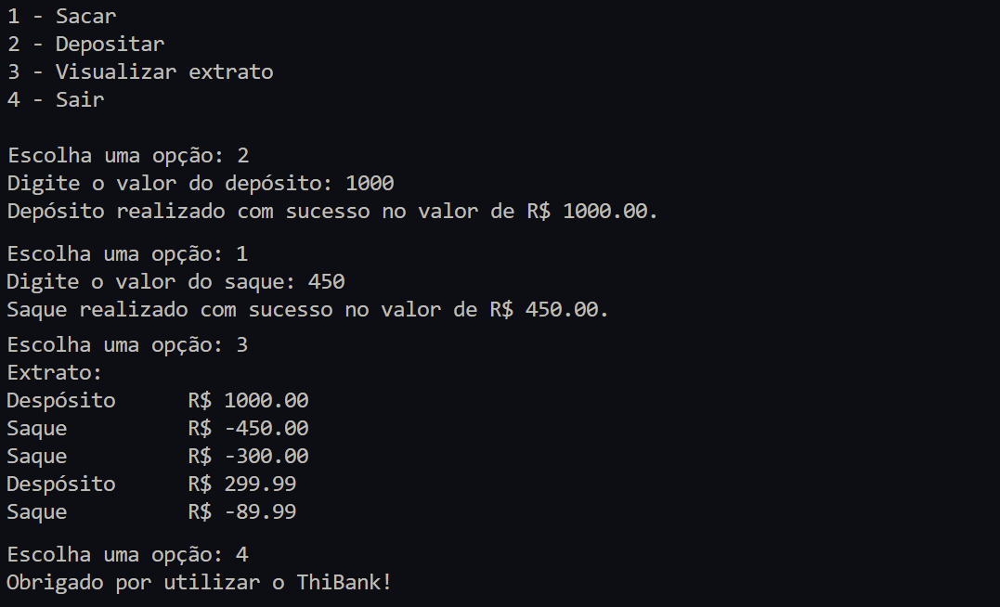

<h1 align="center">Desafio de Projeto 1</h1> 

<p align="center">
<a href="https://www.python.org/">
  
</a>
</p>

### Proposta
- Criar um sistema bancário com as operações: sacar, depositar e visualizar extrato
- A versão 1.0 do sistema trabalha apenas com 1 usuário, não sendo necessário identificar o numero da agência e conta.
- Todos os depósitos e saques são armazenados em uma lista, que é o extrato do usuário.
- Deve permitir 3 saques diários com limite máximo de R$ 500,00 por saque.
- Caso o usuário tente sacar mais que o limite, deve retornar uma mensagem de erro.

### Resolução
<p align="center">

</p>

### Como executar o projeto
1. Fazer instalação do [Python 3+](https://www.python.org/downloads/).
2. Fazer download ou clone desta pasta.
3. Na pasta local executar o comando
```bash
python main.py
```
