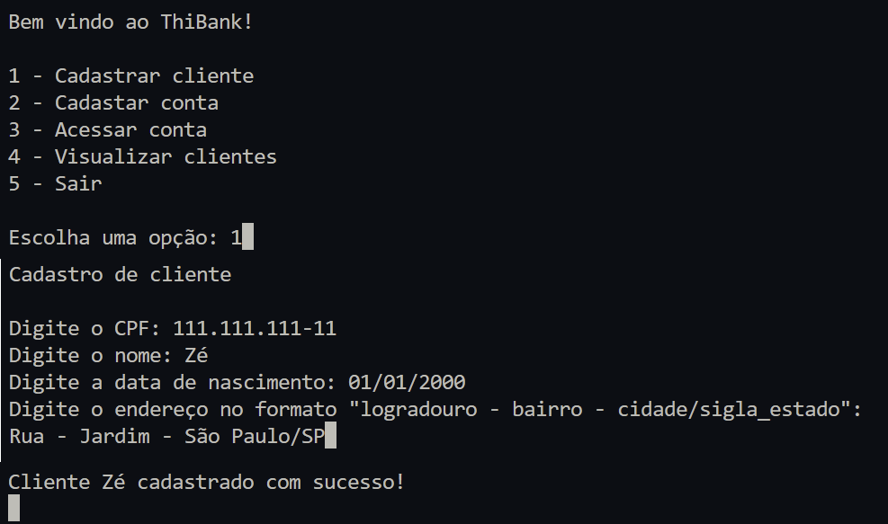
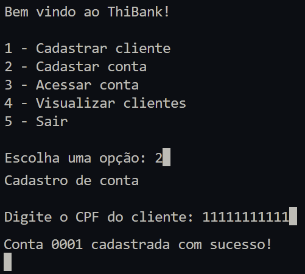
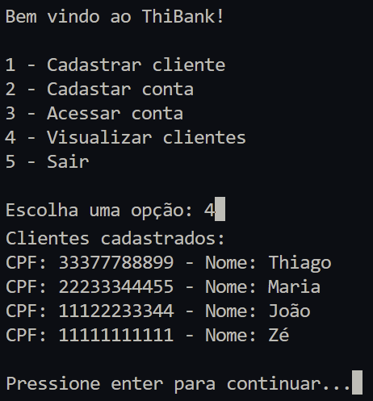
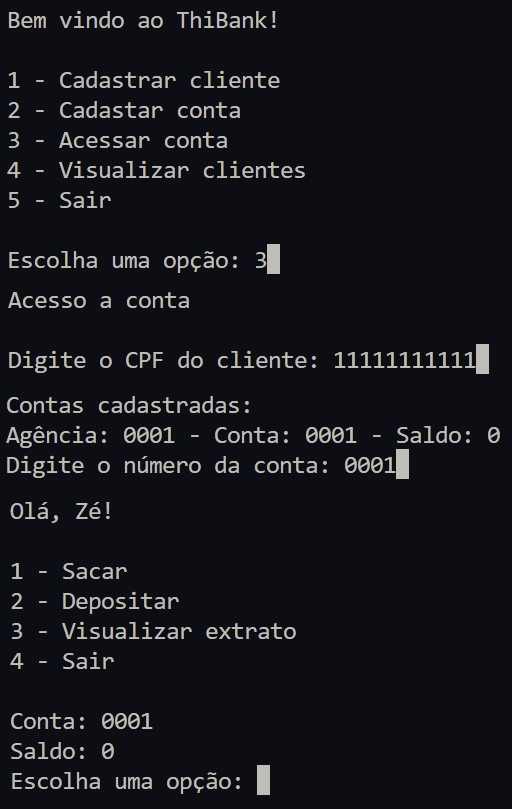
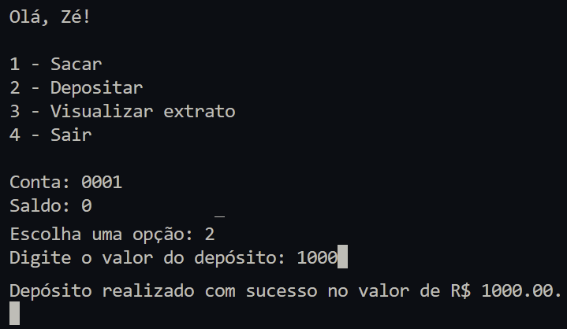
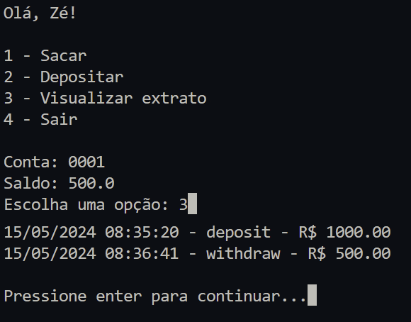

<h1 align="center">Desafio de Projeto 2</h1> 

<p align="center">
<a href="https://www.python.org/">
  
</a>
</p>

### Proposta
- Usar como base o projeto 1
- Utilizar funções para saque, depósito e extrato.
  - A função de saque deve receber valores apenas por keywords.
  - A função de depósito deve receber valores apenas por posição.
  - A função de extrato deve receber valores por keywords e por posição.
- Criar função para cadastrar cliente e conta bancária.
- Criar usuário deve receber nome, data de nasimento, cpf e endereço.
  - Deve ser armazenado somente numeros do CPF.
    - CPF não pode ser repetido.
- Endereço deve ser uma string no formato "logradouro - bairro - cidade/sigla_estado"
- Deve armazenar a conta em uma lista com as informações agência, numero da conta e usuário.
  - O número da conta é sequencial e a agência é fixa como "0001".
- O usuário pode ter mais de uma conta.

### Resolução
#### 1. Cadastro de clientes
<p align="left">

</p>

#### 2. Cadastro de conta
<p align="left">

</p>

#### 3. Visualizar clientes
<p align="left">

</p>

#### 4. Acessar Conta
<p align="left">

</p>

#### 5. Deposito
<p align="left">

</p>

#### 6. Saque
<p align="left">

</p>

#### 7. Extrato
<p align="left">

</p>

### Como executar o projeto
1. Fazer instalação do [Python 3+](https://www.python.org/downloads/).
2. Fazer download ou clone desta pasta.
3. Na pasta local executar o comando
```bash
python main.py
```
